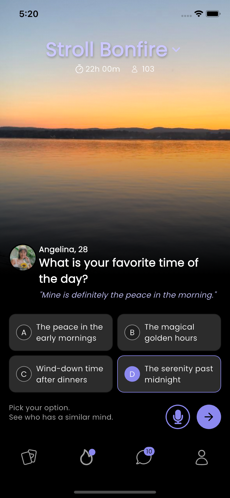

# Stroll Bonfire Task

This Flutter app replicates the Stroll Bonfire UI as part of the interview task. It is built using Flutter and Riverpod for state management.

## Features
- Replicates the design perfectly for iOS and Android devices.
- Uses Riverpod for state management.
- Responsive layout for common devices.

## Getting Started
1. Clone the repository:
```git clone https://github.com/mj-963/stroll_bonfire_task.git```

2. Navigate to the project directory:
```cd stroll_bonfire_task```

3. Run the app:
```flutter run```


## Screenshots


